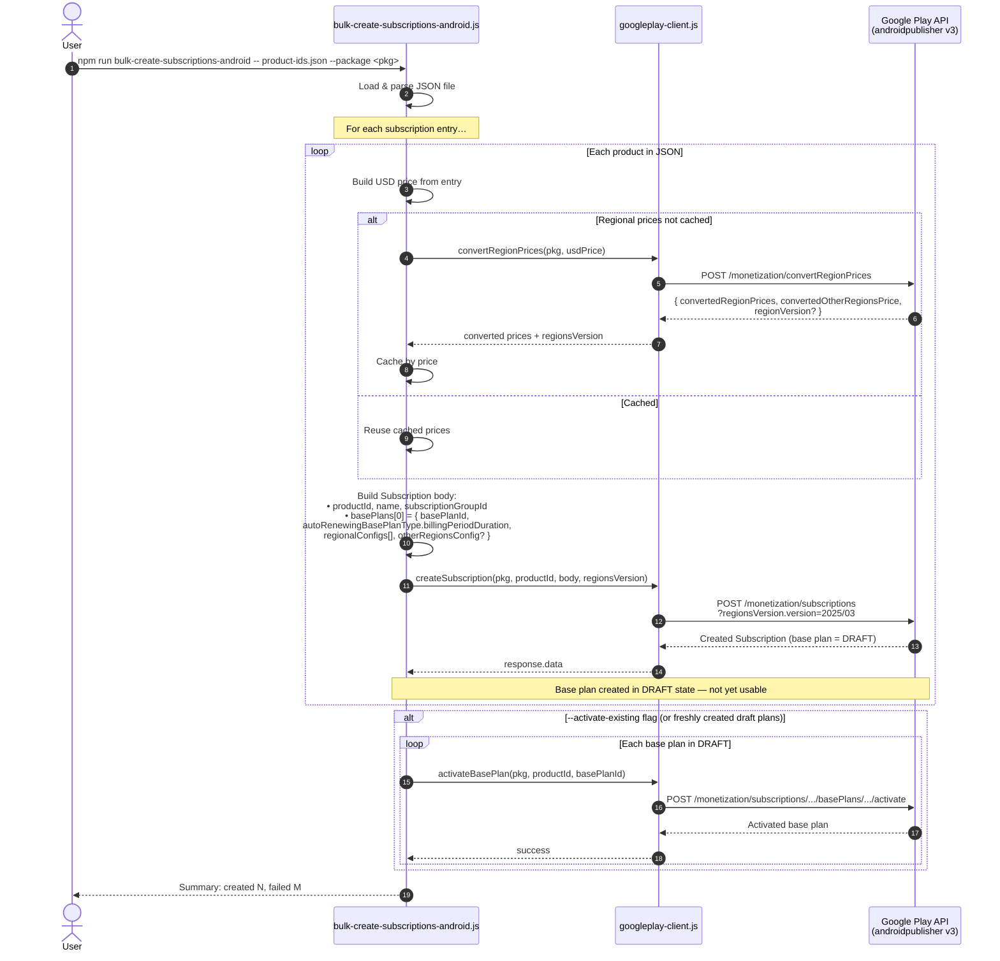
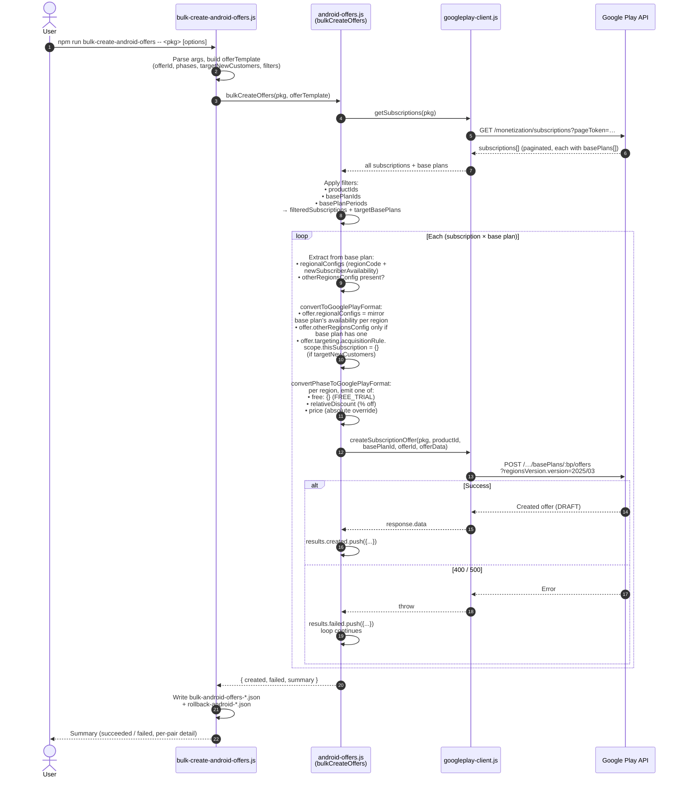
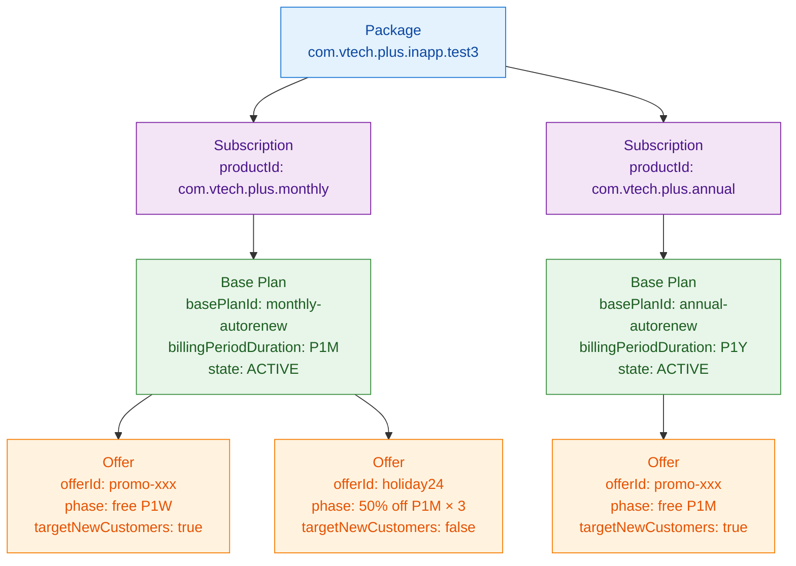

# Android (Google Play) Sequence Diagrams

Visual walkthrough of the two main Android subscription flows in this repo, as they hit Google Play's API.

- [1. Subscription + Base Plan Creation](#1-subscription--base-plan-creation)
- [2. Offer Creation (on an Existing Base Plan)](#2-offer-creation-on-an-existing-base-plan)
- [Resource Model Recap](#resource-model-recap)
- [Key Things Google Validates](#key-things-google-validates)

---

## 1. Subscription + Base Plan Creation

Driven by `npm run bulk-create-subscriptions-android -- <json-file> --package <package-name>`.

Each line in the input JSON becomes one `Subscription` in Google Play that embeds exactly one `BasePlan`. Base plans are created in `DRAFT` state — they must be **activated** in a separate call before they can be used.

### Key points

- `convertRegionPrices` is called **once per distinct USD price** and cached — avoids thrashing the API for products that share a price.
- The `regionsVersion.version` parameter tells Google which snapshot of "supported regions" you're targeting (`2025/03` is the current default).
- `createSubscription` creates the subscription and its **first base plan** as one nested payload. Multi-base-plan subscriptions would need separate `basePlans.create` calls (not currently used).
- A base plan starts in **DRAFT** state. Until activated, it's invisible to users and can't receive offers.
- **Offers depend on active base plans** — see the next flow.

---

## 2. Offer Creation (on an Existing Base Plan)

Driven by `npm run bulk-create-android-offers -- <package-name> [options]`.

The CLI does **not** know base plan IDs up front — it pulls them from Google by listing subscriptions, then iterates every `(subscription × base plan)` pair matching the optional filters (`--product-ids`, `--base-plan-ids`, `--plan-period`). Each pair gets one offer.

### Key points

- Google exposes subscriptions and base plans on **one list call** (`subscriptions.list` paginated) — no need to fetch base plans separately.
- An offer's `regionalConfigs` **must be a subset** of the base plan's, and `newSubscriberAvailability` must not exceed what the base plan allows.
- An offer's `otherRegionsConfig` can only exist if the base plan has one. Mismatches produce either a clean 400 ("Other regions location was set in phase 0, but not in the top level") or an ugly 500 ("Internal error encountered").
- `regionsVersion.version` is a **query parameter** (not in the body) and is required — without it Google returns `400 "Regions Version must be specified."`
- A created offer starts in **DRAFT** and must be **activated** (`POST /…/offers/:id/activate`) before users see it. The bulk script leaves offers in DRAFT so you can review before going live.
- One offer ID is reused across every `(product, base plan)` pair — Google scopes offer IDs to `(product, basePlan)`, so collision isn't possible across pairs.

---

## Resource Model Recap

- One package → many subscriptions → many base plans → many offers.
- Notice **`offerId: promo-xxx` appears twice** — under different base plans. Legal, because offer IDs are scoped to `(productId, basePlanId)`.
- Base plan availability and pricing define the **ceiling** for every offer under it.

---

## Key Things Google Validates

These are the invariants the real Google Play API enforces that surfaced during this project's debugging:

| Invariant | Error you get if violated |
|---|---|
| `regionsVersion.version` query param set | `400 "Regions Version must be specified."` |
| Every region in payload billable under the chosen `regionsVersion` | `400 "Region code X is not billable at the specified regions version Y."` |
| Offer `regionalConfigs[i].newSubscriberAvailability` ≤ base plan's for the same region | `400 "Region code X was set to be available to new subscribers by the offer, but is not available in parent base plan."` |
| Offer-level and phase-level `otherRegionsConfig` both set OR both omitted | `400 "The Other regions location was set in phase 0, but not in the top level."` |
| Offer `otherRegionsConfig` only set when base plan has one | `500 "Internal error encountered."` *(Google choking on the inconsistency rather than returning a clean 400)* |
| Phase type implied by payload shape (`free` / `relativeDiscount` / `price`), **not** by a `subscriptionOfferPhaseType` field | `400 "Unknown name 'subscriptionOfferPhaseType' at 'subscription_offer.phases[0]': Cannot find field."` |
| `targeting.acquisitionRule.scope` uses `thisSubscription: {}` / `specificSubscriptionInApp` / `anySubscriptionInApp` — **not** `scopeType` | `400 "Unknown name 'scopeType' at 'subscription_offer.targeting.acquisition_rule.scope': Cannot find field."` |
| Service account has Play Console **write** permission on the target app | `403 "The caller does not have permission"` |

---

**Last Updated:** April 2026
